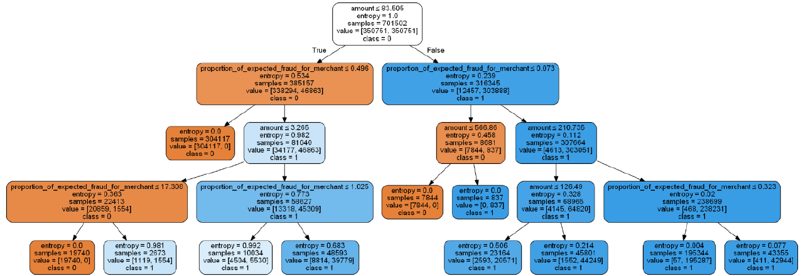
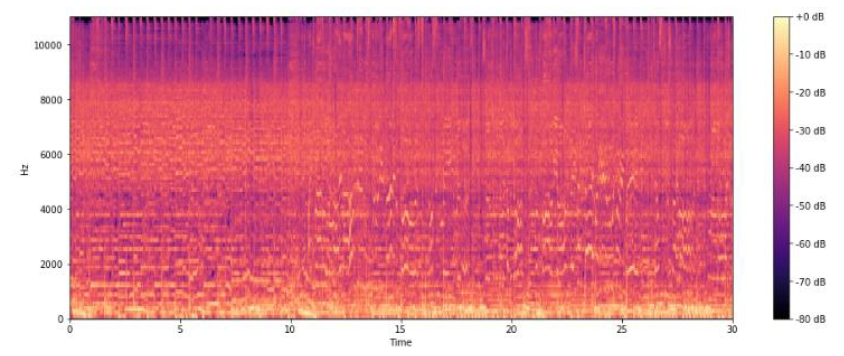
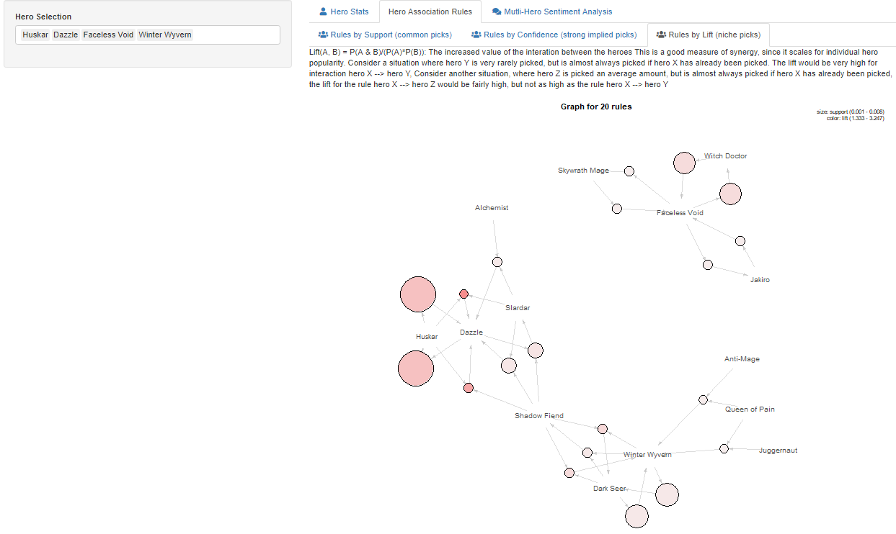
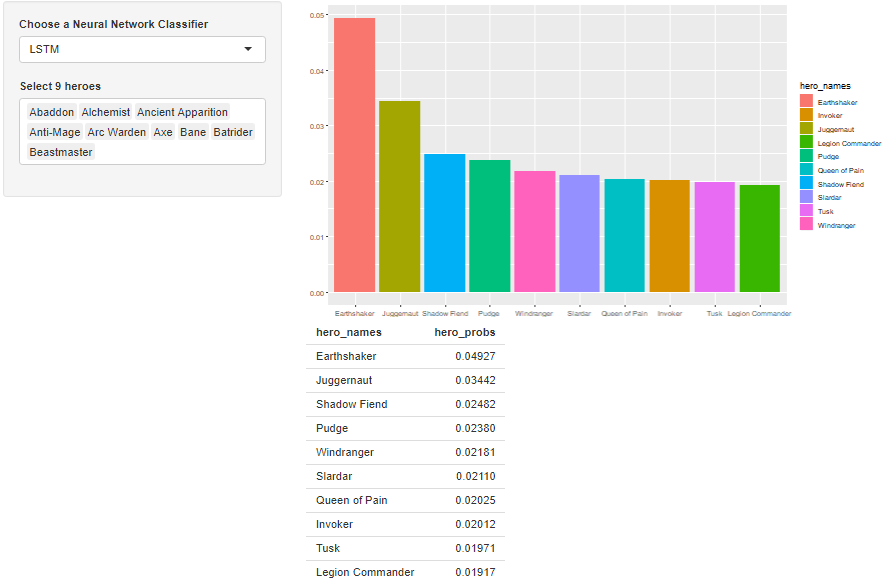
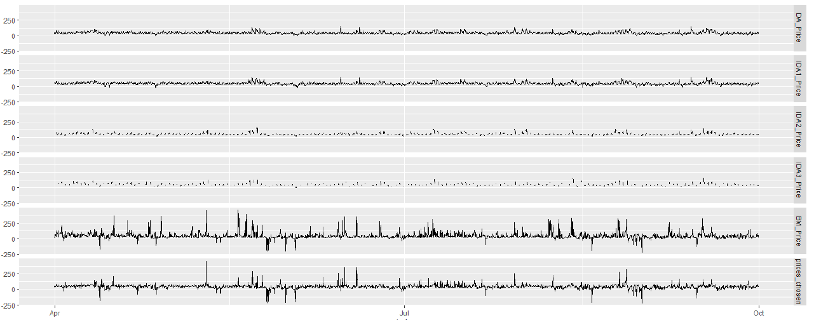
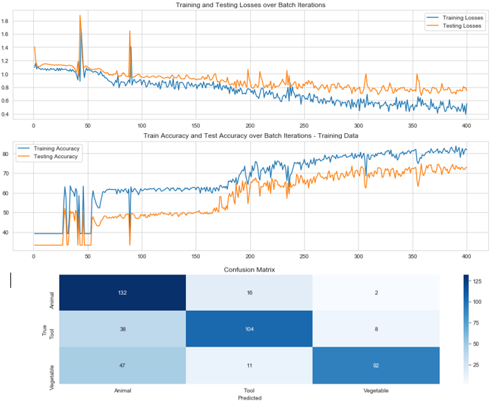

# Portfolio
Overview of Data Science projects to date

## Project 1: [Fraud Detection](https://github.com/RMCox/Fraud-Detection)
[report PDF](https://github.com/RMCox/Fraud-Detection/blob/master/Fraud_Detection_Project.pdf)
Created a Model to detect instances of Online Credit Card Fraud, implementing solutions that fulfilled the additional requirement for interpretability, and addressed the specific nuances of Fraud Detection.

* Exploratory Data Analysis and Data Wrangling.
* Evaluation and subsequent rejection of Principle Component Analysis.
* Oversampling to address Data Balance.
* Evaluation of Metrics, and Precision/Recall trade-off.
* Feature Engineering motivated by findings from EDA.
* Comparison and Assessment of various Models, Considering Success Metrics, Interpretability and Computational Expense.
* Conclusion to Implement Random Forest model using Engineered Features.
* Grid Search for hyperparameter Tuning.
* Discussion of Practical Implementation into a Bank's Strategy.

## Project 2: [Musical Genre Classification](https://github.com/RMCox/Music-Genre-Classification)
[report PDF](https://github.com/RMCox/Music-Genre-Classification/blob/master/Musical_Genre_Classification.pdf)
Created and compared 2 Neural Networks to classify a database of 1000 audio tracks into their 10 musical genres: A convolutional neural network trained on visual representations of the audio, and a linear neural network based on extracted musical features.

* Pre-processed the audio files using functions to pad and crop.
* Extracted key features of the Audio using the Librosa package, e.g. spectral bandwidth.
* Outlier detection to reveal and remove corrupted files.
* for interest, compared musical genres using cosine similarity, created a function to identify similar songs (resulted in tracks by the same artist).

**Convolutional Neural Network**
* Converted audio files to Mel-Spectrograms for visual representation.
* Trained a Convolutional Neural Network using Pytorch using ReLU activation functions and dropout.
* Use of model to predict individual tracks, outputting probability of each genre.

**Linear Neural Network**
* Used extracted key features to predict labels after addressing multi-collinearity.
* Achieved higher accuracy using extracted features than the visual representation.
* Use of model to predict individual tracks, outputting probabilty of each genre.

## Project 3: [DOTA 2 Dashboard](https://github.com/RMCox/DOTA-2-Dashboard)
Created a dashboard in R Shiny with multiple features for analytics of 50,000 DOTA 2 Matches.
The dashboard was designed to assist with hero drafting, showing multiple hero win-rates, association rules and neural networks to predict the final pick in any game based on previous picks.

* Data Wrangling to merge many dataframes, cleaning to retain only matches that contained a full set of players.
* Tab for win rates and pick rates, allowing the user to compare and contrast heroes.
* Tab for Association Rules showing Support, Confidence and Lift. Allows the User to see common, implied and niche picks for any selected heroes.
* Tab showing common words in the chat for winning and losing games.
* Tab incorporating a Linear and a Long-Short-Term-Memory Neural Network to predict the final pick of a game based on previous picks. The reticulate package was used to link to Python code.

## Project 4: [Energy Price Modelling](https://github.com/RMCox/Energy-Price-Prediction)
Co-Author: Brid Roissetter https://uk.linkedin.com/in/br%C3%ADd-roissetter-618127170

[Report PDF](https://github.com/RMCox/Energy-Price-Prediction/blob/master/Energy_Price_Prediction.pdf)

Time Series Analysis in R. Used Generalised Additive Models (GAMs) to predict energy prices on the energy futures market, and choose an optimal strategy to minimise costs for an energy supplier.

* Performed EDA to explore the variable distributions and relationships, which revealed the need for a non-linear model.
* Implemented GAMs iteratively as energy prices became available, to predict prices for each energy market.
* Feature engineering to add lagged variables, which increased the variance explained by the GAMs.
* Tested the effectiveness of ARIMA modelling.
* Performed bootstrap aggregation to gauge how the model would perform on many random points in the data. Constructed confidence intervals for energy costs.

## Project 5: Image Recognition
Basic classification task, creating a linear, convolutional and recurrant neural networks to classify images into animals, vegetables and tools in Pytorch.

